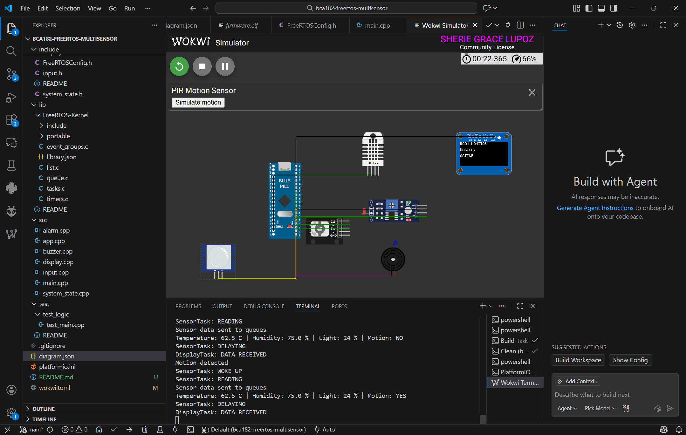
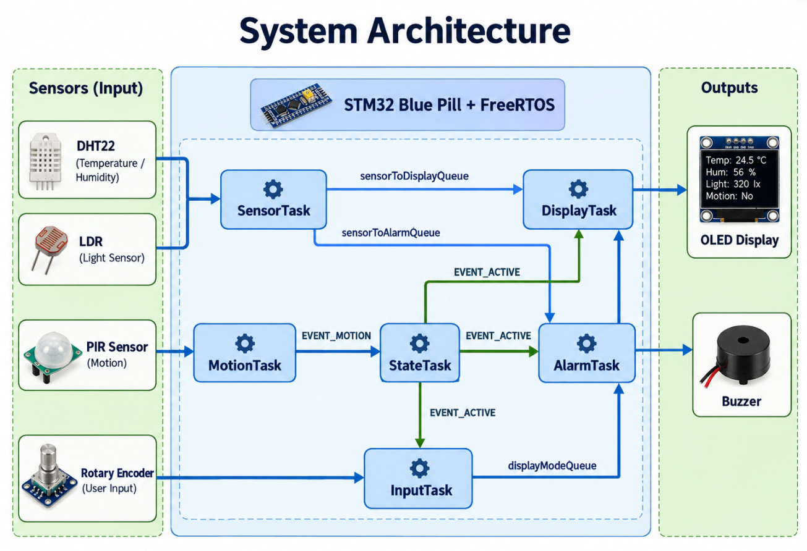
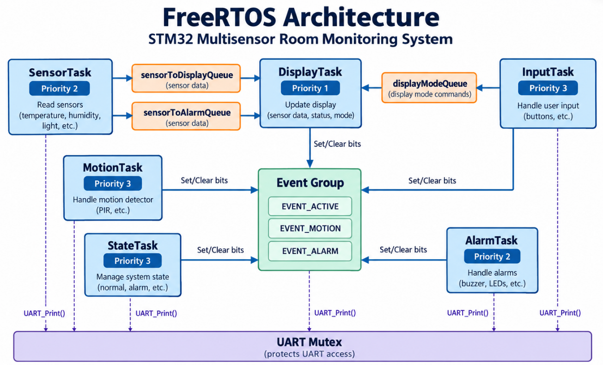
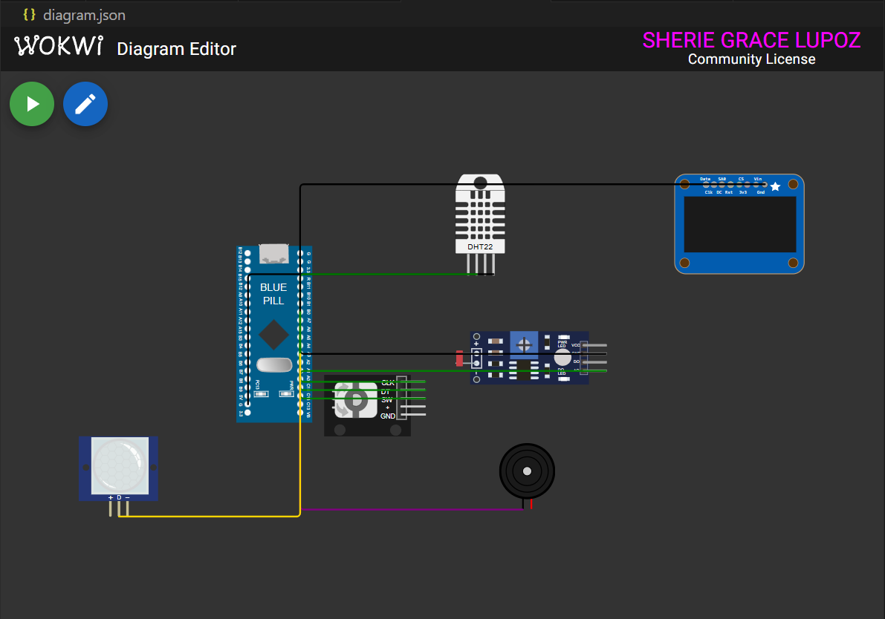
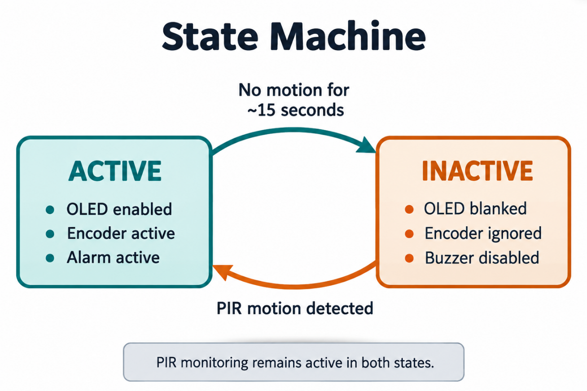

# FreeRTOS-Based STM32 Multisensor Room Monitoring System



*Figure 1. Finished Wokwi simulation of the STM32 multisensor room monitoring system.*

## Project Overview

This project is a real-time multisensor room monitoring system developed using an STM32 Blue Pill, STM32Cube HAL, FreeRTOS, PlatformIO, and Wokwi.

The system monitors temperature, humidity, ambient light, and motion. Sensor information is displayed on an SSD1306 OLED, while a rotary encoder allows the user to switch between different display pages.

A buzzer is used as a temperature alarm. The system also supports ACTIVE and INACTIVE operating states. When no motion is detected for approximately 15 seconds, the system becomes INACTIVE. Motion detected by the PIR sensor automatically returns the system to ACTIVE.

The project demonstrates multitasking, task scheduling, queues, event groups, mutexes, state machines, unit testing, and static code analysis using FreeRTOS and PlatformIO.

---

## Features

- Temperature monitoring using DHT22
- Humidity monitoring using DHT22
- Ambient light monitoring using an LDR
- PIR motion detection
- SSD1306 OLED display
- Rotary encoder page navigation
- Temperature alarm using a buzzer
- ACTIVE and INACTIVE system states
- Automatic inactivity after approximately 15 seconds
- Automatic reactivation after PIR motion detection
- FreeRTOS task scheduling
- Queue-based sensor communication
- Event-group-based system signaling
- UART mutex protection
- Periodic sensor sampling using `vTaskDelayUntil()`
- Automated unit testing using Unity
- Static code analysis using PlatformIO

---

## Learning Objectives

This project was developed to practice and understand the following embedded systems concepts:

- STM32 development using PlatformIO
- STM32Cube HAL peripheral programming
- FreeRTOS task creation and scheduling
- Task priorities and blocking behavior
- Queue-based inter-task communication
- Event groups for system events
- Mutexes for shared-resource protection
- Periodic task execution
- Embedded state-machine design
- Separation of hardware and application logic
- Unit testing of hardware-independent functions
- Static code analysis
- Git and GitHub development workflow

---

## System Architecture

The DHT22 and LDR are periodically read by `SensorTask`. Sensor readings are sent through FreeRTOS queues to `DisplayTask` and `AlarmTask`.

The PIR sensor is monitored by `MotionTask`. Motion information is communicated using a FreeRTOS event group and is used by `StateTask` to control the ACTIVE and INACTIVE states.

The rotary encoder is handled by `InputTask`, while `DisplayTask` controls the OLED.



*Figure 2. Overall system architecture of the STM32 multisensor room monitoring system.*

---

## FreeRTOS Architecture

The system uses multiple FreeRTOS tasks, queues, an event group, and a mutex to organize the application.



*Figure 3. FreeRTOS tasks, priorities, and inter-task communication used in the project.*

| Task | Priority | Responsibility |
|---|---:|---|
| MotionTask | 3 | Monitors PIR motion |
| InputTask | 3 | Processes rotary encoder input |
| StateTask | 3 | Manages ACTIVE and INACTIVE states |
| SensorTask | 2 | Reads DHT22 and LDR |
| AlarmTask | 2 | Evaluates temperature and controls buzzer |
| DisplayTask | 1 | Updates the OLED |

Higher-priority tasks are assigned to functions that require faster response, such as motion detection and user input.

Sensor processing and alarm handling use medium priority because they can tolerate a small scheduling delay.

`DisplayTask` uses a lower priority because OLED updates are less time-critical.

All continuously executing tasks block, delay, or wait when appropriate to prevent unnecessary CPU usage.

---

## Hardware / Simulated Components



*Figure 4. Complete Wokwi circuit of the STM32 multisensor room monitoring system.*

| Component | Purpose |
|---|---|
| STM32 Blue Pill | Main microcontroller |
| DHT22 | Temperature and humidity |
| Photoresistor / LDR | Ambient light |
| PIR Motion Sensor | Motion detection |
| Rotary Encoder | User navigation |
| SSD1306 OLED | Information display |
| Buzzer | Temperature alarm |

---

## Pin Configuration

| Component | STM32 Pin |
|---|---|
| LDR Analog Output | PA0 |
| DHT22 Data | PA1 |
| Buzzer | PA2 |
| PIR Output | PA3 |
| Encoder CLK | PA4 |
| Encoder DT | PA5 |
| Encoder Button | PB0 |
| OLED SCL | PB6 |
| OLED SDA | PB7 |
| USART1 TX | PA9 |
| USART1 RX | PA10 |

---

## Task Design

### SensorTask

`SensorTask` periodically reads the DHT22 and LDR.

The task runs approximately every two seconds using:

```cpp
TickType_t lastWakeTime = xTaskGetTickCount();

for (;;)
{
    readSensors();

    vTaskDelayUntil(
        &lastWakeTime,
        pdMS_TO_TICKS(2000)
    );
}
```

`vTaskDelayUntil()` helps maintain a regular sampling period and reduces timing drift compared with repeatedly using `vTaskDelay()`.

Sensor information is sent to other tasks using FreeRTOS queues.

### DisplayTask

`DisplayTask` owns the SSD1306 OLED.

The available display pages are:

- Temperature
- Humidity
- Light
- Motion

Keeping OLED operations inside one task helps prevent different tasks from attempting to update the display at the same time.

### InputTask

`InputTask` handles the rotary encoder.

Clockwise navigation follows:

```text
Temperature
    ↓
Humidity
    ↓
Light
    ↓
Motion
    ↓
Temperature
```

Counterclockwise rotation performs the reverse sequence.

The navigation logic is separated into:

```cpp
nextDisplayMode()
previousDisplayMode()
```

This allows the navigation logic to be unit tested without requiring the physical encoder.

### MotionTask

`MotionTask` continuously monitors the PIR sensor.

When motion is detected, it updates the `EVENT_MOTION` bit in the event group.

Motion monitoring remains operational even when the system becomes INACTIVE.

### StateTask

`StateTask` manages the two system operating states:

- ACTIVE
- INACTIVE

If no motion is detected for approximately 15 seconds, the system enters INACTIVE mode.

If the PIR sensor detects motion while INACTIVE, the system returns to ACTIVE mode.

### AlarmTask

`AlarmTask` receives temperature data through a queue and controls the buzzer.

The configured normal temperature range is:

```text
18 °C to 30 °C
```

The possible alarm states are:

```text
NORMAL
LOW_TEMPERATURE
HIGH_TEMPERATURE
```

If the temperature is below 18 °C or above 30 °C while the system is ACTIVE, the buzzer activates.

Temperature decision logic is separated into:

```cpp
evaluateTemperature()
```

This allows the alarm logic to be tested independently from the buzzer hardware.

---

## Inter-Task Communication

### Sensor Queues

Two queues are used for sensor information:

```text
SensorTask
   |
   +----> sensorToDisplayQueue ----> DisplayTask
   |
   +----> sensorToAlarmQueue ------> AlarmTask
```

Sensor information uses the following structure:

```cpp
struct SensorData
{
    float temperature;
    float humidity;
    int lightLevel;
    bool motionDetected;
};
```

### Display Mode Queue

The selected OLED page is sent from `InputTask` to `DisplayTask` using:

```text
displayModeQueue
```

### Event Group

The project uses a FreeRTOS event group for important system conditions.

```cpp
#define EVENT_ACTIVE (1 << 0)
#define EVENT_MOTION (1 << 1)
#define EVENT_ALARM  (1 << 2)
```

| Event Bit | Main Source | Purpose |
|---|---|---|
| `EVENT_ACTIVE` | StateTask | Indicates the system is ACTIVE |
| `EVENT_MOTION` | MotionTask | Indicates PIR motion |
| `EVENT_ALARM` | AlarmTask | Indicates a temperature alarm |

### UART Mutex

Several tasks print diagnostic information through USART1.

A FreeRTOS mutex protects UART access:

```cpp
xSemaphoreTake(uartMutex, portMAX_DELAY);

HAL_UART_Transmit(
    &huart1,
    (uint8_t *)msg,
    strlen(msg),
    HAL_MAX_DELAY
);

xSemaphoreGive(uartMutex);
```

The mutex helps prevent serial output from multiple tasks from becoming interleaved.

---

## State Machine

The system operates using two main states: ACTIVE and INACTIVE.



*Figure 5. ACTIVE and INACTIVE state machine of the room monitoring system.*

### ACTIVE State

When ACTIVE:

- OLED is enabled
- Sensor processing continues
- Rotary encoder is active
- Temperature alarm is active
- PIR sensor monitors motion

### INACTIVE State

When INACTIVE:

- OLED is blanked
- Encoder input is ignored
- Buzzer is disabled
- PIR sensor continues monitoring
- Motion automatically restores ACTIVE mode

---

## Repository Structure

```text
bca182-freertos-multisensor/
│
├── .vscode/
│
├── docs/
│   ├── images/
│   │   ├── finish-system.png.png
│   │   ├── freertos-architecture.png.png
│   │   ├── state-machine.png.png
│   │   ├── system-architecture.png.png
│   │   └── wokwi-circuit.png.png
│   │
│   └── laboratory-report.pdf
│
├── include/
│   ├── FreeRTOSConfig.h
│   ├── alarm.h
│   ├── app.h
│   ├── buzzer.h
│   ├── display.h
│   ├── input.h
│   └── system_state.h
│
├── lib/
│   └── FreeRTOS-Kernel/
│
├── src/
│   ├── alarm.cpp
│   ├── app.cpp
│   ├── buzzer.cpp
│   ├── display.cpp
│   ├── input.cpp
│   ├── main.cpp
│   └── system_state.cpp
│
├── test/
│   └── test_logic/
│       └── test_main.cpp
│
├── diagram.json
├── platformio.ini
├── wokwi.toml
└── README.md
```

---

## Getting Started

### Requirements

Install the following:

- Visual Studio Code
- PlatformIO
- Git
- Wokwi for Visual Studio Code
- GCC/G++ for native unit testing

### Clone the Repository

```bash
git clone <YOUR-GITHUB-REPOSITORY-URL>
cd bca182-freertos-multisensor
```

Replace `<YOUR-GITHUB-REPOSITORY-URL>` with the actual GitHub repository URL.

---

## Building the Project

Build the STM32 firmware using:

```bash
pio run -e bluepill_f103c8
```

A successful build creates the firmware file:

```text
.pio/build/bluepill_f103c8/firmware.elf
```

---

## Running the Wokwi Simulation

1. Open the project in Visual Studio Code.
2. Build the STM32 firmware.
3. Start the Wokwi simulation.
4. Open the Serial Monitor.
5. Change the DHT22 values.
6. Change the LDR value.
7. Trigger the PIR sensor.
8. Rotate the encoder.
9. Observe the OLED and buzzer behavior.

Typical startup messages include:

```text
BCA182 FreeRTOS Multisensor
SYSTEM EVENT GROUP CREATED
SENSOR QUEUES CREATED
DISPLAY MODE QUEUE CREATED
SENSOR TASK CREATED
ALARM TASK CREATED
DISPLAY TASK CREATED
INPUT TASK CREATED
MOTION TASK CREATED
STATE TASK CREATED
```

---

## Unit Testing

The project uses the Unity testing framework through PlatformIO.

The unit tests focus on hardware-independent application logic.

| Test Category | Number of Tests |
|---|---:|
| Temperature alarm logic | 5 |
| Display navigation | 4 |
| System state logic | 4 |
| **Total** | **13** |

### Temperature Tests

The following conditions are tested:

- Below the lower temperature limit
- Exactly at the lower limit
- Normal temperature
- Exactly at the upper limit
- Above the upper limit

### Navigation Tests

The navigation tests verify:

- Forward navigation
- Forward wraparound
- Reverse navigation
- Reverse wraparound

### State Tests

The state-machine tests verify:

- ACTIVE without timeout
- ACTIVE with timeout
- INACTIVE without motion
- INACTIVE with motion

Run the tests using:

```bash
pio test -e test_native
```

Final test result:

```text
13 tests
13 succeeded
0 failed
```

All 13 unit tests passed successfully.

---

## Static Code Analysis

Static code analysis was performed using PlatformIO and `cppcheck`.

Run:

```bash
pio check -e bluepill_f103c8
```

The static analysis completed successfully for the STM32 Blue Pill environment and did not report significant project-source warnings requiring correction.

---

## Functional Verification

The system was tested in Wokwi by changing simulated sensor values and interacting with the virtual components.

The following behaviors were checked:

| Test | Expected Behavior |
|---|---|
| Temperature change | Displayed temperature updates |
| Humidity change | Displayed humidity updates |
| Light input change | Light value changes |
| Encoder clockwise | Next display page selected |
| Encoder counterclockwise | Previous display page selected |
| Temperature above 30 °C | Alarm activates |
| Temperature returned to normal | Alarm stops |
| PIR triggered | System remains or becomes ACTIVE |
| No motion for approximately 15 seconds | System becomes INACTIVE |
| PIR triggered while INACTIVE | System returns to ACTIVE |

---

## Engineering Decisions

### Separate Sensor Queues

Separate queues are used for `DisplayTask` and `AlarmTask`.

This allows both tasks to receive sensor information without competing to remove the same queue item.

### Interrupt-Based Encoder Detection

The rotary encoder CLK input uses an interrupt to improve responsiveness.

The interrupt records encoder movement while the main navigation logic is processed by `InputTask`.

### Hardware-Independent Logic

Important decision logic was separated from hardware-specific code.

Examples include:

```cpp
evaluateTemperature()
nextDisplayMode()
previousDisplayMode()
evaluateSystemState()
```

This makes the logic easier to test using native unit tests.

### Event Groups

An event group is used because multiple tasks need access to system conditions such as:

- ACTIVE state
- Motion state
- Alarm state

### UART Mutex

USART1 is shared by several tasks for debugging output.

The mutex ensures that one task completes its UART operation before another task accesses the same resource.

---

## Limitations

- The system is mainly tested using Wokwi simulation.
- Physical sensors may introduce noise and timing differences.
- The LDR value represents relative light level rather than calibrated lux.
- A physical rotary encoder may require additional hardware or software debouncing.
- The DHT22 has limited sampling speed.
- The approximately 15-second inactivity timeout is intentionally short for demonstration.
- Physical hardware may require additional filtering and electrical protection.

---

## Future Improvements

Future improvements could include:

- Calibrated light measurement
- Sensor data logging
- Real-time clock support
- Wireless communication
- Wi-Fi or Bluetooth connectivity
- Sensor history storage
- Configurable alarm thresholds
- OLED configuration menus
- Additional environmental sensors
- Improved rotary encoder debouncing
- Physical STM32 hardware testing
- More advanced power-saving modes

---

## References and Acknowledgments

This project was developed as part of the BCA182 Embedded Systems Programming laboratory activity.

Technologies and tools used include:

- STM32 Blue Pill
- STM32Cube HAL
- FreeRTOS
- PlatformIO
- Wokwi
- Unity Test Framework
- cppcheck
- Git
- GitHub

Special acknowledgment is given to the course instructor for the laboratory requirements and guidance throughout the activity.